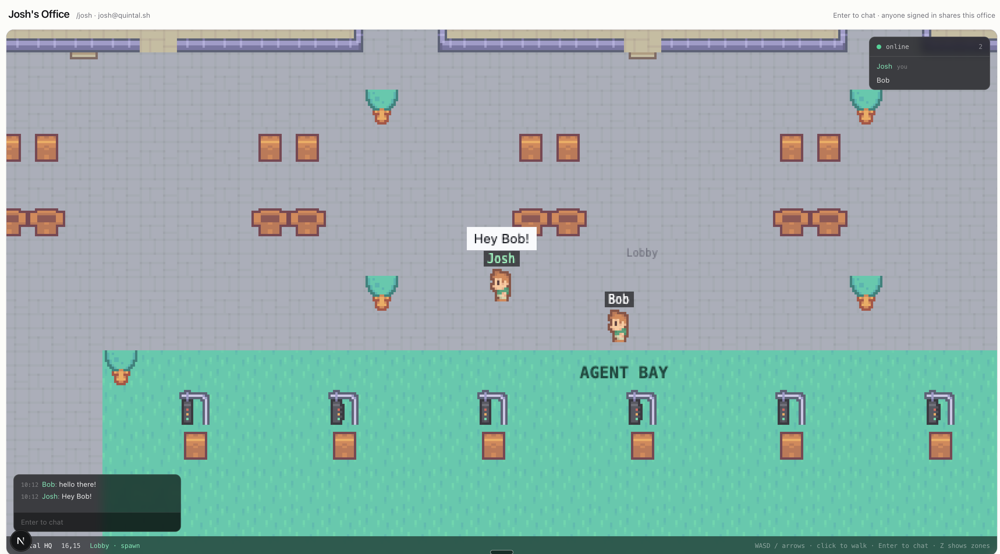

# Quintal

**A spatial office where your AI agents are visible teammates.** Quintal gives
your work a place: a 2D office you walk around as an avatar, built for one
developer plus their fleet of AI agents. Agents aren't a sidebar or a log tail —
they get avatars, desks, status and presence, so a glance at the room tells you
what your fleet is doing and where. Other humans can be invited in, but nothing
assumes a team.



> **Under construction.** This is early, and honest about it.
>
> **Works today:** sign in with a magic link, walk around a tile map with
> collision and click-to-move pathfinding, and share the office with other
> people in real time — server-authoritative movement, name labels, a roster,
> and proximity chat that only carries as far as your voice would.
>
> **Not yet:** the agent gateway, so the fleet the whole thing is *for* can't
> log in and walk around — that's next. No voice, no Docker image.
>
> Building in public means you can watch that happen — every file here is
> world-readable and written with that in mind.

## Quickstart

Requires Node 20.11+ and [pnpm](https://pnpm.io) 11+.

```bash
pnpm install
cp .env.example .env   # optional — the defaults work as-is
pnpm dev
```

Then open <http://localhost:3000>. Sign in with any email: without an email
provider configured, the magic link is **printed to the server console** — that
is a supported way to run a solo instance, not just a dev hack.

You land in the office at `/office`. **WASD or arrow keys** to walk, **click**
to route there with pathfinding, **Enter** to chat with whoever is nearby, **Z**
to show the zone and collision overlay. Open a second browser, sign in as
someone else, and you'll see each other.

The database is created for you at `data/quintal.db` and migrations run on boot.
There is no setup command to forget.

| Command | What it does |
| --- | --- |
| `pnpm dev` | Web on :3000 + game server on :2567, two processes, fast HMR |
| `pnpm build` | Build shared → web → server |
| `pnpm start` | **One** process serving web + game server on one port |
| `pnpm typecheck` | Typecheck every package |
| `pnpm test` | Run the test suite (movement, pathfinding, map, state sync) |
| `pnpm db:generate` | Generate a migration after changing the schema |
| `pnpm db:seed` | Create a local demo user + personal workspace (idempotent) |

There's a [`justfile`](./justfile) with the same recipes (`just dev`, `just
db-generate`, …) if you prefer `just`.

## Architecture

Quintal deploys as **one service**. In production a single Node process serves
both the Next.js app and the Colyseus WebSocket server from the same HTTP server
and port — same origin, no CORS, one thing to deploy and one thing to restart.
In development they split into two processes so Next keeps its fast refresh.

```
                    ┌──────────────── production: ONE process ────────────────┐
                    │                                                         │
  browser ──────────┤  apps/server (entry point)                              │
   :3000            │    ├─ http.Server ──┬─ /health          -> JSON status  │
                    │    │                ├─ /colyseus/*      -> Colyseus     │
                    │    │                └─ everything else  -> Next.js      │
                    │    ├─ Colyseus 0.16 (WebSocketTransport, OfficeRoom)    │
                    │    └─ next({ dir: '../web' }) prepared in-process       │
                    └─────────────────────────────────────────────────────────┘

  development: next dev :3000  ──rewrite /colyseus/*──>  apps/server :2567
```

The `/colyseus` prefix is identical in both modes, so client code always points
at `${origin}/colyseus` — in dev `next dev` proxies it (including the WebSocket
upgrade), in production `apps/server` strips the prefix and hands the request to
Colyseus.

```
apps/
  web/        Next.js 15 App Router, TypeScript strict, Tailwind v4 + shadcn/ui.
              Pages: / (landing), /login (magic link), /office (protected, hosts
              the Phaser canvas). Not deployed on its own — the server serves it.
  server/     The production entry point. Boots Colyseus, applies database
              migrations, and in production initialises Next.js in-process.
packages/
  shared/     Everything both sides must agree on: the Tiled map and its
              parser, the movement simulation, A* pathfinding, the Colyseus
              room schema and wire protocol, the game/UI event bridge, and the
              Drizzle schema, migrations and database client.
tools/        One-shot scripts, e.g. the generator that bootstrapped the map.
```

**Storage** is SQLite through Drizzle ORM and the libSQL client, in WAL mode.
`DATABASE_URL` defaults to `file:./data/quintal.db`; the same variable takes a
`libsql://` URL (e.g. Turso) with no code changes — no Postgres-only types are
used anywhere. Pending migrations are applied automatically on boot, so
self-hosters never run a migration command.

**The world** is a [Tiled](https://www.mapeditor.org/) map at
`packages/shared/maps/hq.json` — three meeting rooms, an open floor, and a large
central Agent Bay — rendered with [Phaser 3](https://phaser.io). It lives in
`packages/shared` because the game server reads the same file: the walkability
grid the browser predicts against is the one the server simulates against, not a
second opinion that drifts. Game state stays inside Phaser and reaches React
through a typed event bridge, so a 60fps loop never touches the reconciler.

**Movement is server-authoritative.** Clients send *intent* — a direction, or a
tile to walk to — and the room simulates at 20Hz and broadcasts positions;
position never travels client-to-server, so there is nothing to lie with. The
browser predicts locally by running *the same movement code* from
`packages/shared`, which is the only reason prediction and authority stay in
agreement; disagreements are eased away, and large ones snapped. Other people
are drawn a fraction of a second behind real time and interpolated, because
smooth beats momentarily accurate in a room you walk around in.

**Chat** carries 12 tiles and is stored nowhere. It exists before agents do
because it's the medium agents will speak through — the same proximity
broadcast, reading the same `kind` field.

Art is [Kenney's](https://kenney.nl) CC0 RPG Urban Pack — see
[apps/web/public/assets/CREDITS.md](./apps/web/public/assets/CREDITS.md).

**Auth** is [Better Auth](https://better-auth.com) with email magic links and
sessions in the database. Onboarding is solo-first: on first sign-in you get a
personal workspace (`"<name>'s Office"`) with you as owner. There is no
team-setup screen anywhere.

See [SELF_HOSTING.md](./SELF_HOSTING.md) for deployment, and
[.env.example](./.env.example) for every environment variable.

## Contributing

Issues and PRs are welcome — see [CONTRIBUTING.md](./CONTRIBUTING.md). All
commits need a DCO `Signed-off-by` line (`git commit -s`); a GitHub Action
enforces it.

## License

[AGPL-3.0](./LICENSE). If you're wondering why AGPL and what it means for you as
a self-hoster — short version: everything is free, forever — read
[LICENSE-FAQ.md](./LICENSE-FAQ.md).
