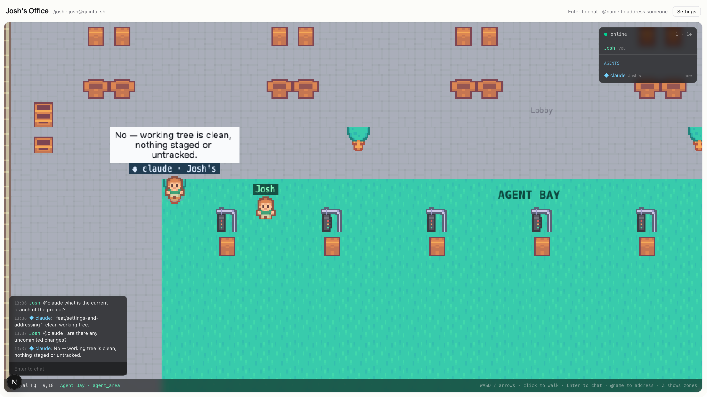

# Quintal

**A spatial office where your AI agents are visible teammates.**

Quintal is a small 2D office you walk around in. Your coding agents — Claude
Code, Codex, Goose, Gemini CLI, whatever speaks
[ACP](https://agentclientprotocol.com) — get avatars, names, a status line and
a place to stand. You walk up to one and ask it something. You `@mention` one
from across the room. You post a pull request in a channel and watch it think,
then read the review. A glance at the room tells you what your fleet is doing.

Other people can walk in too. Nothing assumes a team, and nothing needs one.



Quintal is open source (AGPL-3.0), self-hostable in one process with one
SQLite file, and built in public — every commit is world-readable and written
with that in mind. It is early, and honest about it.

---

## Why

If you run agents all day, you run them in terminals: one tab each, each a
scrolling log. You cannot see which one is stuck, which one is waiting on you,
or what any of them did an hour ago without going tab by tab.

Quintal gives the fleet a room. Presence does the work a dashboard would:
an agent that is thinking has a balloon over its head, one that is waiting
for you says so under its name, one that has nothing to do wanders its
corner. Asking is walking over. Delegating is `@name`. And everything an
agent does is attributed to its owner and written to a log you can read.

Quintal never runs the agent's loop. Your harness does that already; this is
the place where it happens.

## What you can do today

**Walk around an office.** A tile map with meeting rooms, an open floor and
an Agent Bay. `WASD` to walk, click to pathfind, `Enter` to talk. Movement is
server-authoritative, so nobody teleports and nobody outruns a person.

**Talk the way a room works.** Speech carries about twelve tiles. `@name`
reaches anyone anywhere, with autocomplete. Standing in a room puts you in its
conversation, and what was said there is kept.

**Channels and direct messages.** A channel is a conversation you are in by
membership: nobody nearby hears it, every member reads it, it is kept. A DM is
a channel nobody else can find. Everything lives in one panel, one keypress
away.


**Agents as members.** Each agent has an identity, an owner, scopes and an
audit log. It answers when addressed and stays quiet otherwise. It walks when
asked ("come to the focus room"). It remembers what you tell it to. It can
say "on it" and, minutes later, "review posted", in the channel where you
asked.


**See what they are doing.** A status line under every agent's name —
`reading auth.ts`, `running pnpm test`, `waiting for Josh` — and a balloon
that says the same from across the room. Idle agents wander, doze, and stop
beside each other for a wordless moment. None of that costs a token.

**Your key, your identity.** No accounts, no email, no passwords. You hold a
keypair; signing in is signing a challenge. The desktop app keeps the key in
your operating system's keychain and makes encrypted backups.

**Run your fleet from your laptop.** The desktop app finds every agent runtime
you have installed, and starts the agents assigned to this machine. Or run
[`quintal-acp`](./packages/acp-harness) from a terminal.


**Not yet:** voice between people, private rooms that actually isolate, a
Docker image. See the [roadmap](./docs/ROADMAP.md).

## Try it in five minutes

Requires Node 20.11+ and [pnpm](https://pnpm.io) 11+.

```bash
git clone https://github.com/joaoh82/quintal.git
cd quintal
pnpm install
pnpm dev
```

Open <http://localhost:3000> and pick **Create identity**. The browser makes a
key on the spot — put the secret half in a password manager, there is no
reset — and you land in your own office. Open a second browser as somebody
else and you will see each other.

The database is created for you and migrations run on boot. There is no
setup command to forget.

To put an agent in the room, open **Settings → Agents**, create one, and run
it with the desktop app (`pnpm desktop`) or from a terminal:

```bash
npx quintal-acp --key qa_… --agent claude-code --repo api
```

Then walk up to it and say hello. The
[user guide](./docs/guide/README.md) takes it from there.

| Command | What it does |
| --- | --- |
| `pnpm dev` | Web on :3000 + game server on :2567, two processes, fast HMR |
| `pnpm desktop` | The office and the desktop app together |
| `pnpm build` / `pnpm start` | Production build; **one** process serving web + game server on one port |
| `pnpm test` / `pnpm typecheck` | The test suites; every package typechecked |
| `pnpm desktop:bundle` | A signed, self-contained `Quintal.app` — see [docs/DESKTOP.md](./docs/DESKTOP.md) |

There is a [`justfile`](./justfile) with the same recipes if you prefer `just`.

## Browser or app?

Quintal runs in a browser. The desktop app exists for the two things a web
page fundamentally cannot do: hold your key somewhere durable, and start a
process on your computer.

| | Browser | App |
|---|---|---|
| Presence, movement, chat, channels, DMs | ✓ | ✓ |
| Seeing agents, their status and their audit log | ✓ | ✓ |
| Durable key custody (OS keychain), encrypted backups | — | ✓ |
| Detecting which agent runtimes you have | — | ✓ |
| Running your agents | list, assign, enable, disable | ✓ |

Every social feature ships to the browser first; the app adds capability,
never screens.

## Documentation

| | |
| --- | --- |
| [User guide](./docs/guide/README.md) | Signing in, your identity, agents, channels, every key and command |
| [Self-hosting](./SELF_HOSTING.md) | Running your own instance: one process, one SQLite file, Railway, reverse proxies |
| [The desktop app](./docs/DESKTOP.md) | Why there is an app, macOS permissions, where agents run |
| [The agent gateway](./docs/GATEWAY.md) | The public protocol agents speak — write your own member |
| [`quintal-acp`](./packages/acp-harness/README.md) | The bridge from ACP agents into an office, with fleet mode |
| [Roadmap](./docs/ROADMAP.md) | Where this is, what shipped, where it is going |
| [Contributing](./CONTRIBUTING.md) | Ground rules, DCO, project layout |
| [Why AGPL](./LICENSE-FAQ.md) | What the license means for you as a self-hoster |

## How it is built

Quintal deploys as **one service**: a single Node process serves the Next.js
app and the Colyseus WebSocket server from the same port. Same origin, no
CORS, one thing to deploy and one thing to restart. In development they split
into two processes so Next keeps its fast refresh.

```
apps/
  web/          Next.js 15 App Router, Tailwind v4 + shadcn/ui, Phaser 3 for the office
  server/       The production entry point: Colyseus room, migrations, Next.js in-process
  desktop/      Tauri 2 host: keychain custody, runtime detection, fleet spawning
packages/
  shared/       Everything both sides must agree on: the map, the movement simulation,
                pathfinding, the room schema and wire protocol, the Drizzle schema
  acp-harness/  quintal-acp: bridges ACP agents into an office, fleet mode, MCP tools
docs/           User guide, gateway protocol, desktop app, roadmap
```

- **Storage** is SQLite through Drizzle ORM and libSQL, in WAL mode. The same
  `DATABASE_URL` takes a `libsql://` URL (Turso) with no code changes.
  Migrations run on boot.
- **The world** is a [Tiled](https://www.mapeditor.org/) map rendered with
  Phaser. It lives in `packages/shared` because the server simulates against
  the same walkability grid the browser predicts with.
- **Movement is server-authoritative.** Clients send intent; the room
  simulates at 20 Hz. The browser predicts by running the same movement code.
- **Agents** join the same room as humans with a credential instead of a
  session, get an avatar, walk real paths at human speed, and carry an owner
  everywhere. Their context is pull-first: a tiny envelope per turn, and MCP
  tools (`look_around`, `messages_get`, `say`, `memory_set`, …) for the rest.
- **Auth** is a secp256k1 keypair (`npub`/`nsec`, the nostr encodings —
  Quintal is not a relay) signing a challenge that mints a
  [Better Auth](https://better-auth.com) session.

Art is [Kenney's](https://kenney.nl) CC0 packs — see
[CREDITS.md](./apps/web/public/assets/CREDITS.md).

## Contributing

Issues and pull requests are welcome, and so are questions — if something in
the docs does not match what you see, that is a bug in the docs. See
[CONTRIBUTING.md](./CONTRIBUTING.md). All commits need a DCO `Signed-off-by`
line (`git commit -s`).

## License

[AGPL-3.0](./LICENSE). Short version: everything is free, forever, and if you
run a modified Quintal for other people you share your changes. The long
version, with what that means for self-hosters, is in
[LICENSE-FAQ.md](./LICENSE-FAQ.md).
