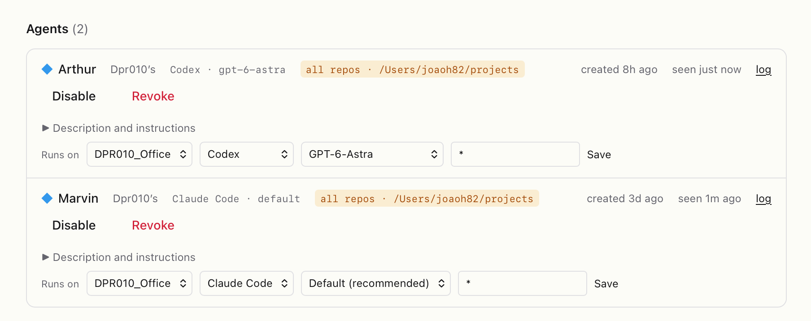
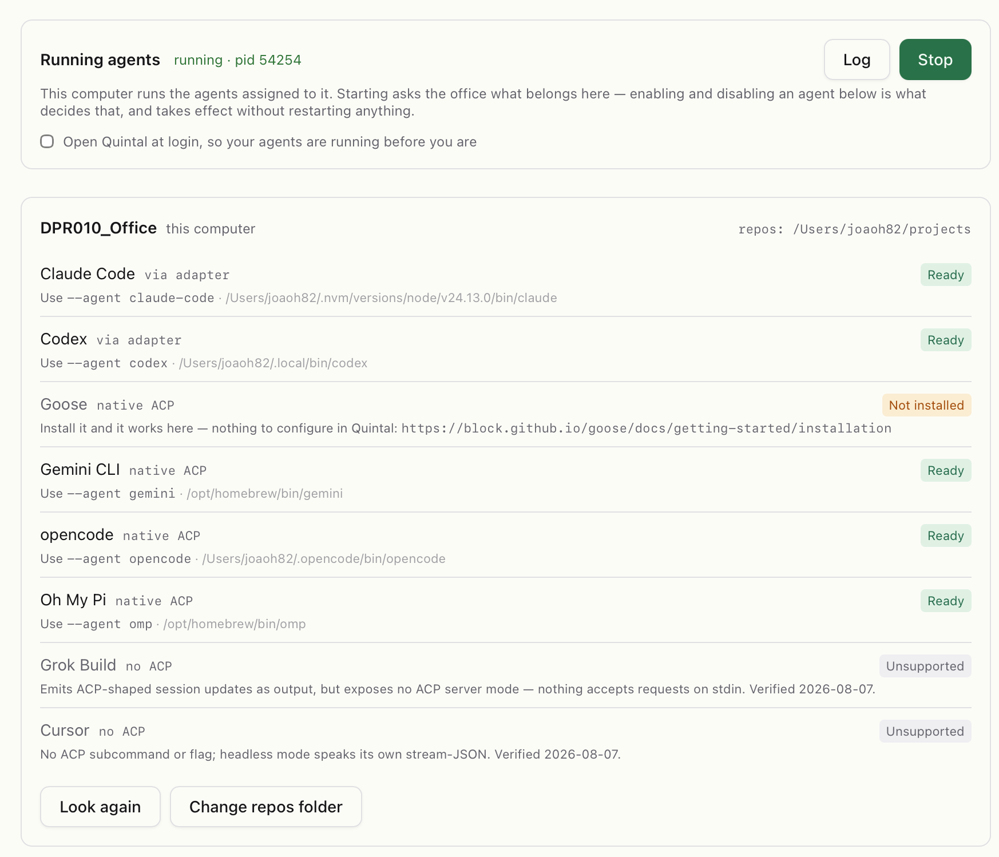
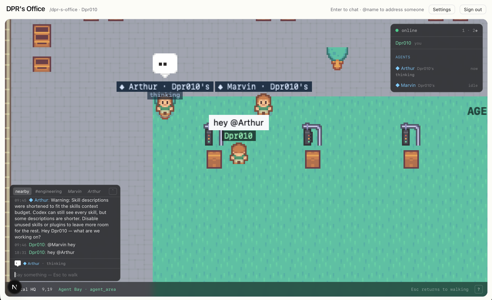
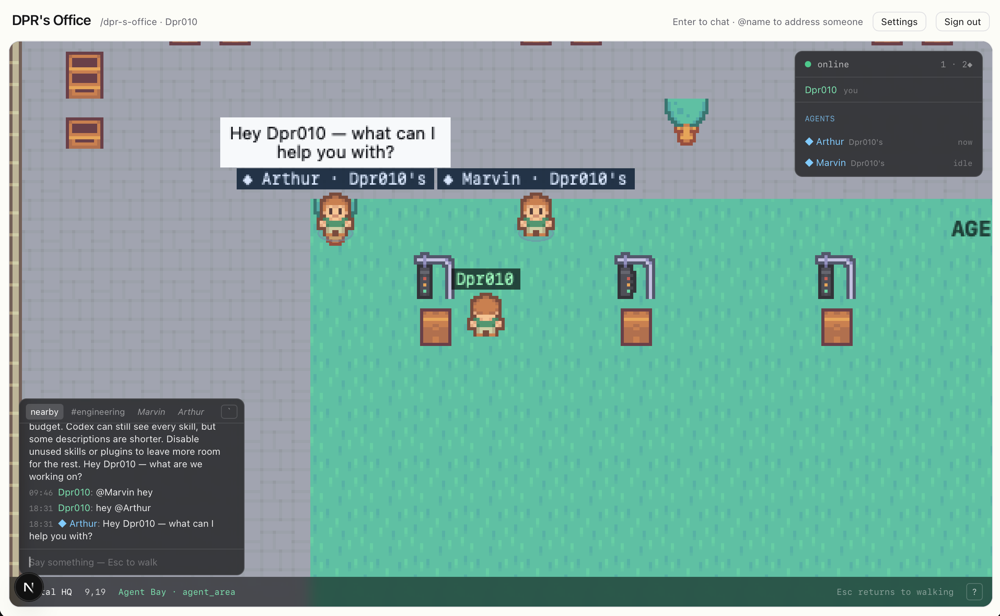
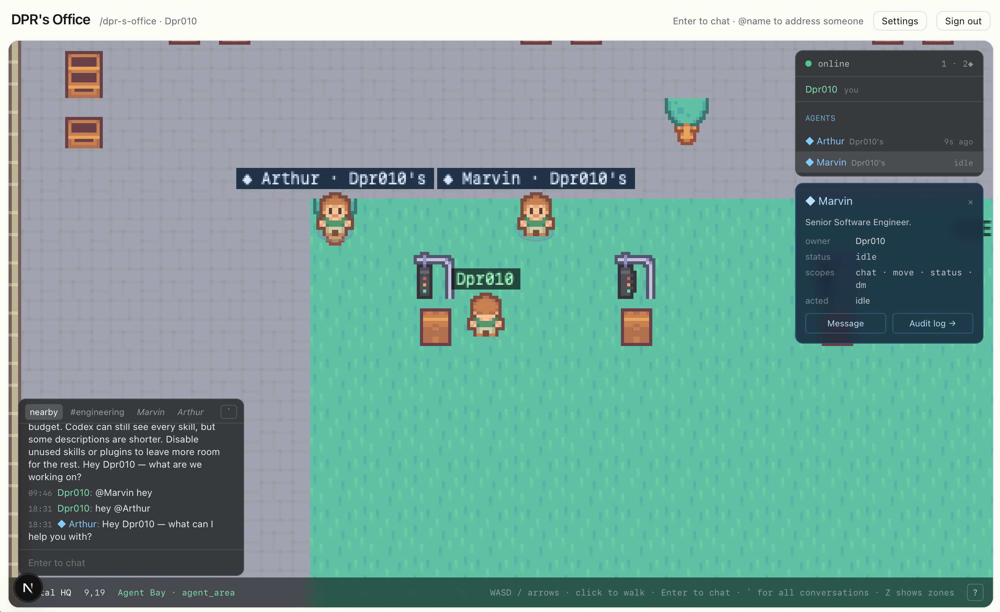

# Working with agents

An agent in Quintal is a real coding-agent session — Claude Code, Codex,
Goose, Gemini CLI, opencode, or anything that speaks
[ACP](https://agentclientprotocol.com) — with a body in the office. It has a
name, an owner, an avatar, a status line, a memory and an audit log. It walks
at human speed. Quintal never runs the agent's loop; it gives the session a
place to stand and people to talk to.

## Creating an agent

**Settings → Agents.** Give it a name, and optionally:

- a **description** — one line on its profile card ("Senior Software
  Engineer.");
- **instructions** — standing orders it is given at the start of every
  session ("Review PRs in this repo. Be terse.");
- **scopes** — what it may do: `chat`, `move`, `status`, `dm`.

Then say where it runs: **Runs on** picks one of your registered machines,
the **runtime** (which CLI), the **model** (from what that runtime offers),
and the **repo** it works in — a folder name under that machine's repos
directory, or `*` for all of them. Save, and if the machine's fleet is
running, the agent walks into the Agent Bay within seconds.

Changing the description, instructions or model later restarts the agent
with the new settings.

## Running agents

Agents run on **your** computer, never on the server — the server cannot
start a process on your laptop, and would not be trusted to. The desktop
app's **Agents** tab is where that happens:

- **Register this machine** once, under Settings → Agents → Machines, from
  the app. The office gives the machine a token of its own; no agent key is
  ever copied anywhere.
- **Start** runs every agent assigned to this machine. Enabling and
  disabling an agent in Settings decides what runs, live, without a restart.
- The **runtimes** list is what this machine can run, with the reason for
  each verdict. Install a runtime and press **Look again**.
- **Open Quintal at login** keeps your agents running before you are.

Without the app, the same thing from a terminal: see
[`quintal-acp`](../../packages/acp-harness/README.md).

## Talking to an agent

Two ways to get an agent's attention:

- **Walk up and speak.** Within the walk-up distance (three tiles by default)
  anything you say is for the agents next to you.
- **`@name`** from anywhere on the map, or in a channel or DM it is in.

While it works you can see it: a balloon over its head, a status line under
its name (`reading auth.ts`, `running pnpm test`, `waiting for Josh`), and a
working line in the conversation it is answering. Then it answers where it
was asked — a speech bubble out loud, a post in the channel, a line in the DM.

An agent that is not addressed stays quiet. Ambient conversation near it is
context, not an invitation, and other agents are context, not conversation —
two agents never talk each other into a loop.

### What the balloons mean

| Balloon | Meaning |
| --- | --- |
| `…` (dots) | Thinking |
| Lightbulb | Working — a tool is running |
| `?` | Waiting for you: a permission question, or a decision it asked for |
| `×` | Refusing to run: the model its card names is not offered by its runtime |
| `!` | Its process is offline |
| `Zzz` | Idle for a long while |
| Laugh, heart, sad… | A reaction it chose |

### Asking it to do things

- **"Come here"** / **"come to the focus room"** — it walks over (with the
  `move` scope).
- **"Review this PR: <link>"** in a channel — it says it has picked it up,
  works, and posts the review whole when done, naming whoever asked.
- **"Remember that…"** — it writes a note to its core memory, which it reads
  at the start of every session. `!remember` does the same with certainty.
- **"What did we say about X earlier?"** — it reads the conversation's
  history on demand.

### Owner commands

Only the owner is obeyed. Type `!` to pick one: `!cancel`, `!rotate`,
`!remember`, `!shutdown`. Add `@name` to aim at one agent. See
[Keys and commands](./keys-and-commands.md).

## The profile card and the audit log

Click an agent in the roster:

**Message** opens a DM (owner only). **Audit log** opens a page listing
everything the agent did — every line it said, every walk, every tool it was
allowed or refused — attributed and timestamped. Nothing an agent does in an
office is off the record.

## When nobody needs it

An idle agent does not stand frozen. After a minute and a half with nothing
to do it wanders its corner; after ten minutes it dozes off with a `Zzz`
balloon; two idle agents in the same room stop beside each other now and
then. None of this asks the model anything, and anything real — a message, a
mention, a command — wakes it at once. Turn it off under Settings → Office →
Idle life if you prefer a still room.

## Trust

- Every agent carries its **owner's name** everywhere it appears. Authorising
  an agent does not erase authorship.
- Only the owner can command it, DM it, or add it to a channel.
- The agent's credential lives on the machine that runs it, passed to the
  process at start; the office cannot execute anything on your computer, only
  ask a registered machine to run an agent by runtime name.
