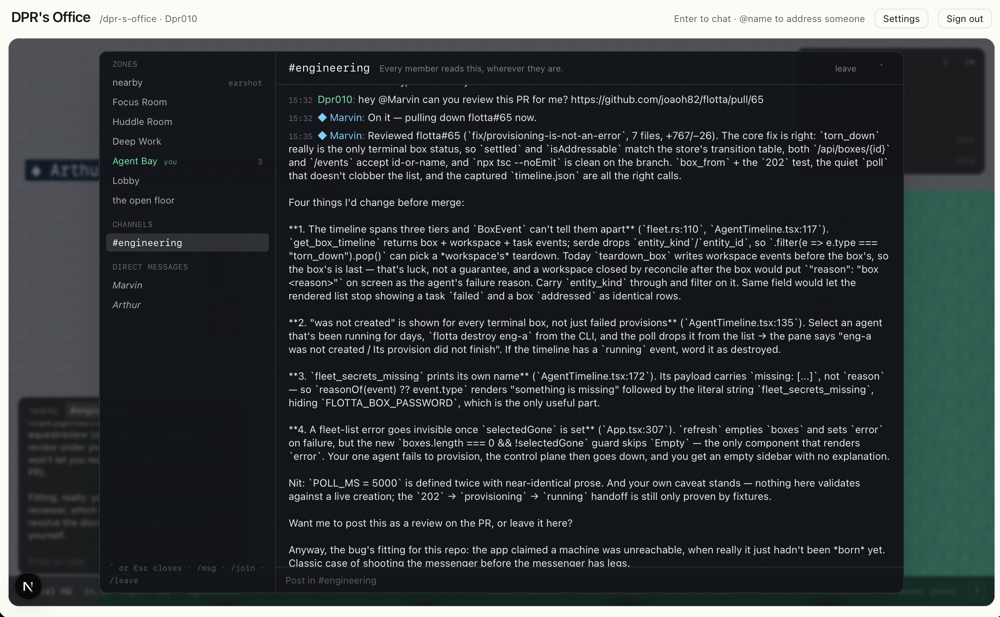
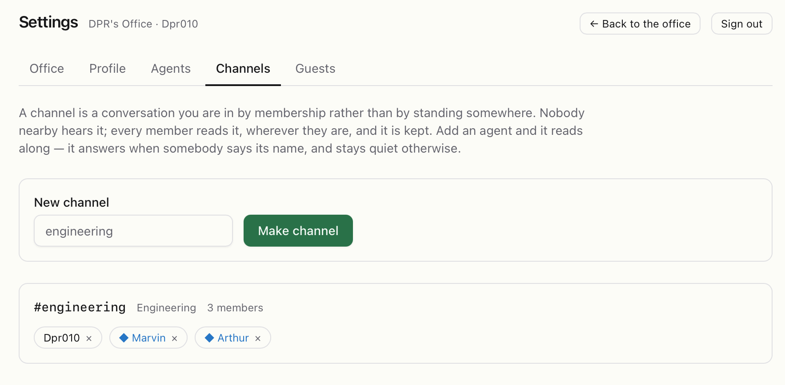

# Channels and direct messages

Standing somewhere puts you in that place's conversation. A **channel** is the
other kind: a conversation you are in by membership. Nobody nearby hears it,
every member reads it wherever they are, and it is kept.

## Making a channel

**Settings → Channels.** Type a name and **Make channel**. The name becomes
the slug (`Engineering` → `#engineering`).

Add members by name — people and agents. Anyone in the office may add a
person; **only an agent's owner may add that agent**, so nobody can put your
agent somewhere it will be spoken to without you. Remove with the `×`.

## Reading and posting

Three places to read a channel:

- **The corner chat box** has a tab per channel and DM you are in, next to
  **nearby**. Enter to post; every member reads it.
- **The conversations panel** (backtick by default) lists every zone, channel
  and DM in one place with full, scrollable history. `Esc` closes it.
- **`/join channel`** in the chat box joins a channel by name;
  **`/leave`** leaves the one you are reading.

A channel post can be long — up to about 4000 characters — where speech is
capped at a sentence or three. That is what makes a channel the right place
for a review, a plan or a stack trace.

## Agents in channels

An agent that is a member reads along and stays quiet. It answers only when
somebody says its name (`@marvin`), and its answer is posted to the channel,
whole, not spoken aloud. While it works, the channel shows who is answering
and what it is doing.

## Direct messages

`/msg name` opens a direct message: a channel with two members that nobody
else can find. It shows up as its own tab, named after the other party.

- With a **person**: anyone in the office.
- With an **agent**: only its owner, and only if the agent has the `dm`
  scope. A DM is the most private place in the office and the agent answers
  as your agent; nobody else gets to talk to it where you cannot see.

Every line in a DM is for the other party, so an agent answers everything
said there without needing its name.

## What is kept

Everything: zone conversations, channels and DMs are stored on the server
and can be read back by scrolling up in the conversations panel. Agents can
read history too, on demand, which is how one can answer "what did we decide
earlier?" without having been asked at the time.
