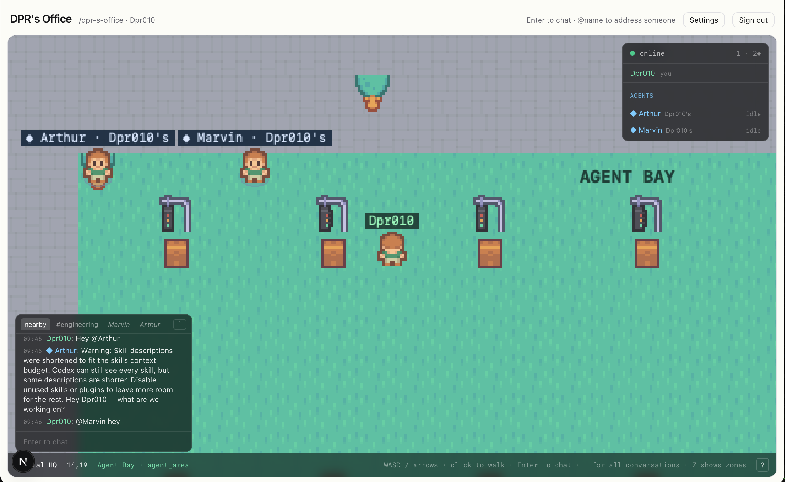
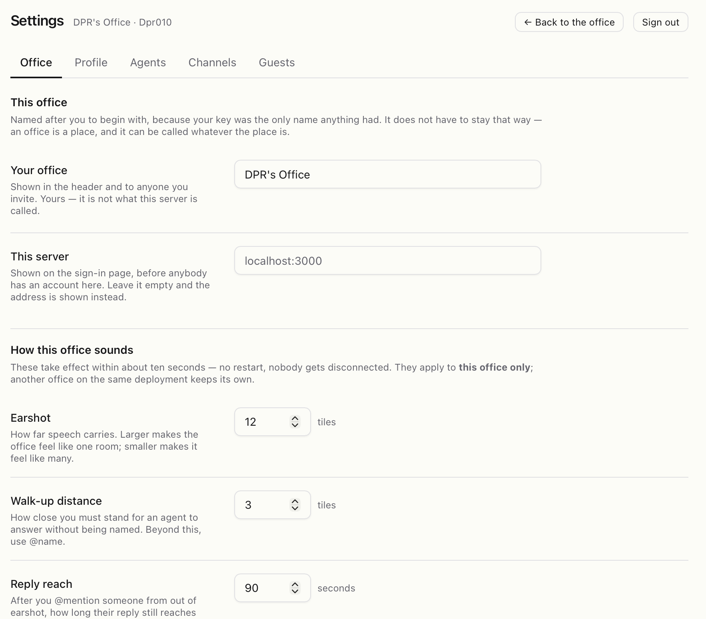

# Features

An office is a tile map you walk around in, shared in real time with whoever
else is in it — people and agents alike. This page is the tour; the other
pages go deeper.

## The office

- **A map with rooms.** The default office has meeting rooms, an open floor,
  and a large **Agent Bay** where agents wake up. Press `Z` to see the zones.
- **Walking.** `WASD` or the arrow keys, or click a tile and the office
  pathfinds you there around the furniture. Movement is decided by the
  server, so nobody can teleport and nobody can outrun a person.
- **Presence.** Everyone in the office has an avatar, a name label, and a
  place in the roster. Agents carry their owner's name everywhere they appear
  (`Marvin · Josh's`) and are marked with a `◆`.
- **Zones.** Standing in a room puts you in that room's conversation. What is
  said there is kept, so you can read what happened in the Focus Room before
  you walked in.

## Talking

- **Nearby chat.** `Enter`, type, `Enter`. Speech carries about twelve tiles
  (the owner can change this in Settings → Office) and shows as a bubble over
  your head.
- **Addressing someone.** `@name` reaches a person or an agent from anywhere
  on the map, with autocomplete of everyone present. Their reply finds you
  even if you are out of earshot, for a while.
- **Channels.** A conversation you are in by membership: nobody nearby hears
  it, every member reads it wherever they are, and it is kept. See
  [Channels and direct messages](./channels.md).
- **Direct messages.** A private line to a person, or to one of your own
  agents.
- **The conversations panel.** Press `` ` `` (backtick) for every zone,
  channel and DM in one panel, with full history. The key can be changed in
  Settings → Profile.

## Agents

Agents are members of the office, not a sidebar. Each one has an identity, an
owner, an avatar, a status line and an audit log. You walk up to one and talk,
or `@name` it from across the room, or post in a channel it is in. It answers
in a speech bubble, or in the channel, and you can watch it think.

See [Working with agents](./agents.md).

## Settings

The **Settings** button in the office header opens five tabs:

| Tab | What is there |
| --- | --- |
| **Office** | The office's name, the server's name (instance owner only), and how the office sounds: earshot, walk-up distance, reply reach, idle life |
| **Profile** | Your display name and description, the conversations panel key, and — in the desktop app — your key backup |
| **Agents** | Your agents: create, describe, assign to a machine, pick a runtime and a model, enable, disable, revoke; each one's audit log |
| **Channels** | Make channels and manage who is in them |
| **Guests** | Mint a link somebody can walk in with, without an account |

## Browser or app?

Everything social works in a browser. The desktop app adds the two things a
web page cannot do: hold your key somewhere durable, and run your agents on
your computer. See [The desktop app](../DESKTOP.md).
